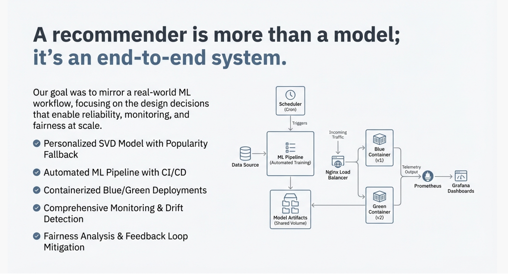

# Shawshank Prediction - Movie Recommendation System (Kafka + ML in Production)   

A production-grade machine learning movie recommendation system that consumes simulated Netflix-style user activity from an Apache Kafka stream to generate personalized movie recommendations using a collaborative filtering model. The system provides low-latency, real-time inference via an HTTP API and is deployed on Amazon EC2 with containerized services. It continuously collects telemetry to monitor system health, data drift, and model quality, and supports automated retraining using newly observed user behavior. A CI/CD pipeline with blue-green deployments enables safe, zero-downtime updates. The system simulates a Netflix-scale environment with approximately 1 million users and 27,000 movies, emphasizing operability, reliability, and long-term evolution over offline model accuracy.



## System Architecture

- **Kafka Stream** — Real-time user activity events  
  ↓
- **Data Processing & Feature Engineering**  
  ↓
- **Collaborative Filtering Model**  
  ↓
- **Recommendation Inference Service (HTTP)**  
  ↓
- **Telemetry & Monitoring**  
  ↓
- **Automated Retraining & CI/CD**  
  ↓
- **Blue-Green Deployment on Amazon EC2**


 ## Key Features

- **Real-time recommendations**  
  Responds to live Kafka events with personalized movie rankings.

- **Collaborative Filtering Model**  
  Learns user–movie interactions from implicit and explicit feedback.

- **Production-Ready Deployment**  
  Hosted on Amazon EC2 with containerized services.

- **Telemetry & Monitoring**  
  Tracks availability, latency, model accuracy proxies, and data drift.

- **Automated Retraining**  
  Periodically retrains models using newly collected interaction data.

- **CI/CD + Blue-Green Deployment**  
  Enables safe, zero-downtime model and service updates using blue-green deployments and scheduled retraining (CRON).

## Tech Stack

1. **Machine Learning:** Collaborative Filtering (matrix factorization and implicit feedback)
2. **Streaming:** Apache Kafka
3. **Backend:** Python (Flask/FastAPI-based inference service)
4. **Infrastructure:** Amazon EC2, Docker
5. **Monitoring:** Telemetry pipelines and dashboards (Prometheus,Grafana)
6. **CI/CD:** GitHub Actions , Hashing
7. **Deployment Strategy:** Blue-Green deployment via load balancing across servers

## API Usage
Get Movie Recommendations
```
GET /recommend/<user_id>
```

Response
```
<movie_id_1>,<movie_id_2>,...,<movie_id_n>
```
Returns up to 20 movie IDs ordered from highest to lowest recommendation score, latency of 0.3-0.6ms

### Model Lifecycle

**Training** → **Inference** → **Telemetry** → **Monitoring** → **Retraining** → **Deployment**

- **Training**: Learn user–movie representations from historical data  
- **Inference**: Serve real-time recommendations  
- **Telemetry**: Capture logs, latency, and feedback via Kafka  
- **Monitoring**: Track drift, accuracy proxies, and availability  
- **Retraining**: Update models with fresh interaction data  
- **Deployment**: Roll out models safely with blue-green deployments


###  Testing & Quality Assurance

- Unit tests for data processing, model pipeline, and inference service  
- Integration tests covering Kafka ingestion and API responses  
- CI pipeline automatically runs tests on every commit  
- Coverage reporting for infrastructure and pipeline code

### 📦 Repository Structure

```text
.
├── app/               # Flask app endpoint, CI/CD hashing
├── data_quality/      # scripts to preprocess incoming kafka data stream, monitor drift
├── dataset/           # Datasets stored as .csv to train models
├── scheduler/         # automatic model retraining config
├── scripts/           # Model training, telemetry, monitoring and kafka scripts
├── tests/             # CI tests for data and model quality
└── nginx.conf         # Blue green deployment for zero downtime
└── docker-compose.yml # containerization setup
```

### Goals & Focus

This project emphasizes:

- **Operating machine learning systems in production**, beyond offline experimentation  
- **Reliability and availability over perfect accuracy**  
- **Continuous monitoring, retraining, and safe deployment practices**  
- **Managing feedback loops and evolving data distributions**


### Notes

This repository was built as part of a Machine Learning in Production course are Carnegie Mellon University and reflects real-world challenges encountered when deploying ML systems at scale. Collaborators: Jayant Sharma, Dhruva Byrapatna, Suraksha Sadana, Kabir Kakkar and Sonal Bhatia. 

##  Getting Started 

### 1. Clone the Repository  
```bash
git clone https://github.com/<your-org>/shawshank-prediction-mlip-project.git
cd shawshank-prediction-mlip-project
```

### 2. Create a Conda Environment  
```bash
conda create -n shawshank-prediction python=3.10 -y
conda activate shawshank-prediction

```
### 3. Install Requirements
```bash
pip install -r requirements.txt
```

## Training Models

### 1. Train SVD Model 
```bash
python scripts/models/train_svd.py
```
Artifacts saved to models/:

svd_model.pkl → trained Surprise SVD model
popular_top20.pkl → fallback top-20 movies

### 2. Train Collaborative Filtering
```bash
python scripts/models/train_cf.py
```
Artifacts saved to models/:
cf_model.pkl → trained CF model

## Evaluation
Run evaluation (accuracy, training time, inference latency, model size):

```bash
python scripts/models/eval_models.py
```
This prints metrics like RMSE/MAE, training duration, per-request latency, and model file size for each algorithm.

## Serving Recommendations

Start the Flask service
```bash
python app/app_flask.py
```

Endpoint
```bash
GET http://localhost:8082/recommend/<userid>
```

-> Known user (warm start): returns up to top-20 movies predicted by the SVD model.

-> Unknown user (cold start): returns a random sample from the top-20 popular movies.

-> Response format: comma-separated movie IDs (not JSON).

Example:
123,456,789,101,112

## Automated Updates and CI/CD Deployment:

Our retraining/rollout workflow is driven by `scripts/automated_retraining.py`, which can:
- optionally pull the latest ratings from Kafka (`--pull-latest`)
- retrain the Surprise SVD model + fallback list
- version artifacts under `scripts/models/` and update `model_metadata.json`
- publish the active artifacts (`svd_model.pkl`, `popular_top20.pkl`) and metadata (`active_model.json`)

Typical cron entry (every 3 days, guarded by `flock` via `scripts/cron/run_retraining.sh`):
```
0 2 */3 * * /bin/bash /path/to/repo/scripts/cron/run_retraining.sh >> /var/log/retrain.log 2>&1
```

For Kubernetes-based deployments use `scripts/docker/retrain-deployment.yaml`, which mounts the shared model volume and runs the same Python entry point inside the retrainer image.

## Provenance & Versioning

- `scripts/models/model_metadata.json`: append-only history of every automated update (model version, git SHA, dataset version info such as path/rows/size/mtime, training notes).
- `scripts/models/active_model.json`: pointer to the model currently in production; hot-reloaded by `app/app_flask.py`.
- `/var/log/recsys/provenance.log`: every `/recommend` response is logged with `{timestamp, route, user_id, model_version, pipeline_git_sha, dataset_version_id, dataset_rows, dataset_size_bytes, dataset_path, latency_ms, rec_ids}` for traceability.

To answer “who produced this recommendation?” find the user/timestamp in `provenance.log`, note `model_version`, then inspect the matching entry in `model_metadata.json` to recover the exact dataset and git commit that produced it.
